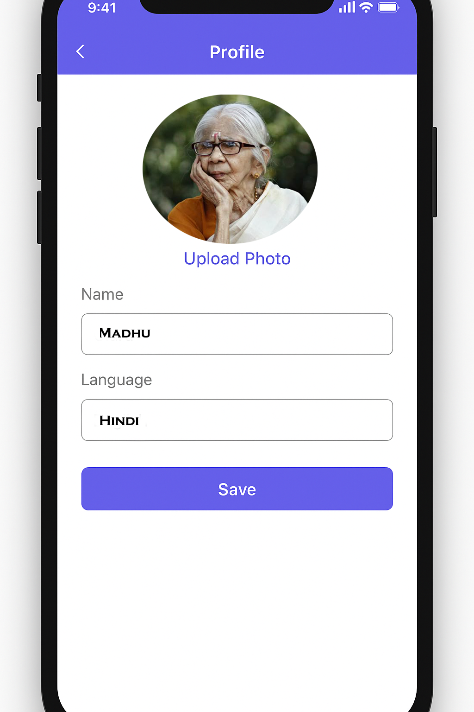
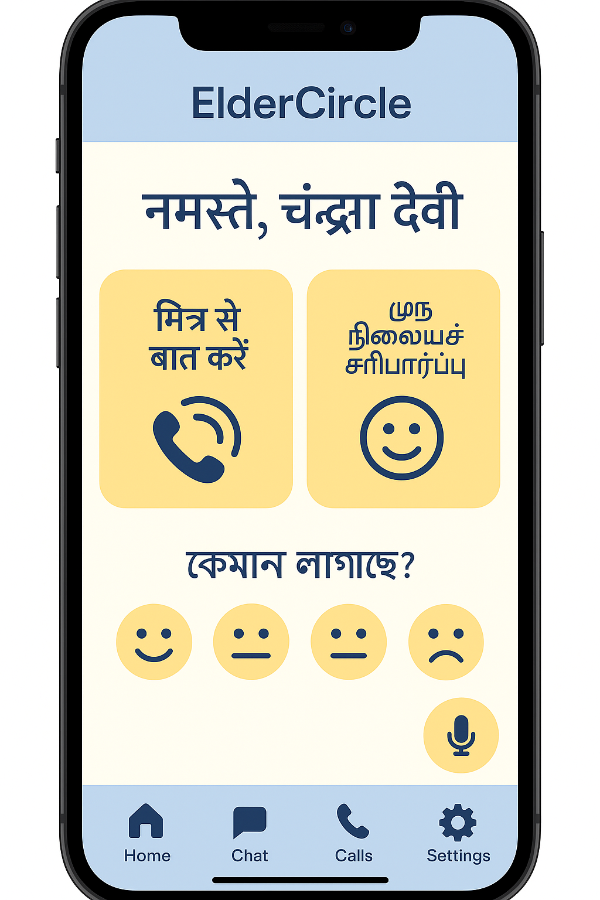
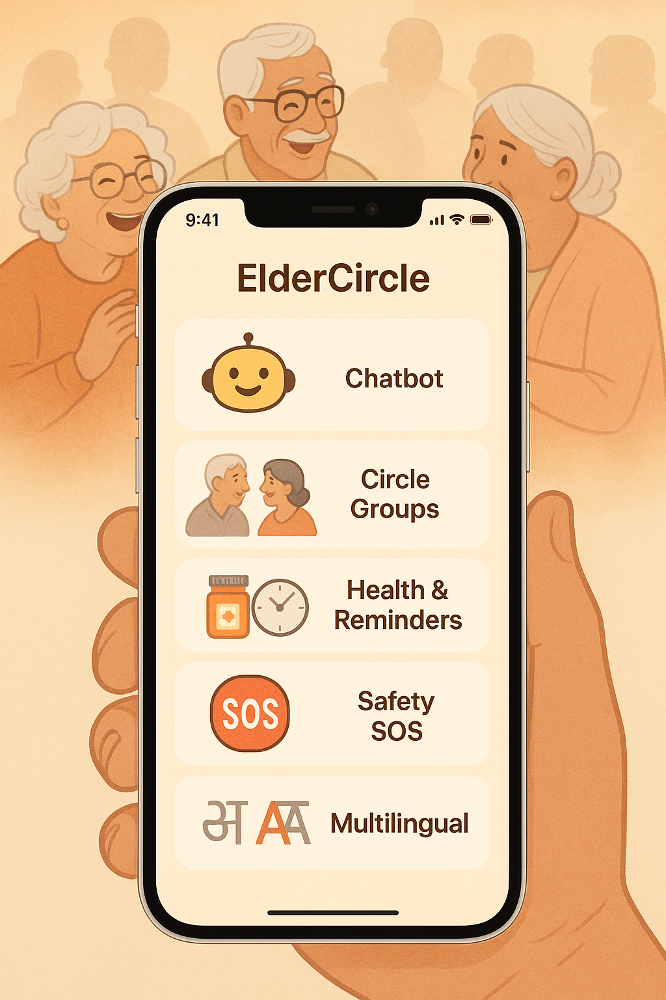

# GURU App – Connect. Care. Communicate.

GURU is an inclusive mobile app designed to connect elderly individuals with companions, counselors, and safety services. Built with empathy, it features multilingual real-time chat, translation, SOS safety tools, and a clean, accessible interface.

---

## Features

- Secure login & user profile setup
- Auto language translation in chats
- Real-time messaging interface
- Emergency SOS button for safety
- Simple navigation & responsive UI
- 🇮🇳 Indian language support built-in

---

# 🙏 Guru App

**A compassionate multilingual AI companion for the elderly**  
Chat, get translations, send safety alerts — all from one place.

---

## 📱 Screenshots

### 🏠 Home Screen  


---

### 💬 Chat with Translation  


---

### 🚨 SOS Safety Alert  


---

## 🔗 Live Documentation

- 🔗 [GitHub Repository](https://github.com/sarmitamajumdar/guru-app)
- 🌐 [Live Site](https://sarmitamajumdar.github.io/guru-app/)

---

## Built With

- **Frontend**: React Native + Expo
- **Backend**: FastAPI + Python
- **API Services**: Google Translate, OpenAI
- **Deployment**: GitHub Pages (Docs), Expo Go (App)

---

## 📂 Folder Structure


## Tech Stack

| Layer       | Tech                             |
|-------------|----------------------------------|
| Frontend    | React Native (Expo)              |
| Backend     | Python (FastAPI or Flask – WIP)  |
| Translation | Google Translate API             |
| Auth        | Firebase Auth (or custom JWT)    |
| Platform    | Android / iOS / Web              |

---

## Screenshots

> Replace with real screenshots

| Home Screen            | Chat with Translation     | Safety Alert       |
|------------------------|---------------------------|--------------------|
|  |  |  |

---

## Local Setup

```bash
# 1. Clone the repository
git clone git@github.com:sarmitamajumdar/guru-app.git
cd guru-app

# 2. Install dependencies
npm install

# 3. Start the Expo server
npx expo start

---

# Contact Me

   Have questions, ideas, or want to support the Guru App mission?

    - ✉  Email: [sarmitamajumdar@gmail.com](mailto:sarmitamajumdar@gmail.com)
    - LinkedIn: [linkedin.com/in/sarmitamajumdar](https://www.linkedin.com/in/sarmitamajumdar)
    - GitHub: [github.com/sarmitamajumdar](https://github.com/sarmitamajumdar)

# 💖 **Support the Project**

   If you believe in technology that **connects and heals**, please consider supporting the development of the Guru App.
   I’m reaching out with something very close to my heart — the GURU App. It's a voice-based, multi-language mobile app designed to comfort and accompany our elderly, especially those living alone.
   
   No complicated features, just a kind voice that listens, reminds, shares spiritual words, and brings comfort.
   
   [](paypal.me/SMajumdar523)
   
   # Alternatively:
   I have launched a fundraising campaign on GoGetFunding to make this vision a reality:
   
   https://gogetfunding.com/support-the-guru-app-empowering-lonely-elderly-lives/  
   
   Even a small contribution can light up a lonely heart. Sharing the link would mean the world to me if you can't donate.
   
   https://gogetfunding.com/support-the-guru-app-empowering-lonely-elderly-lives/  


_Your support can help us make this app available to more elderly users across India._

---


